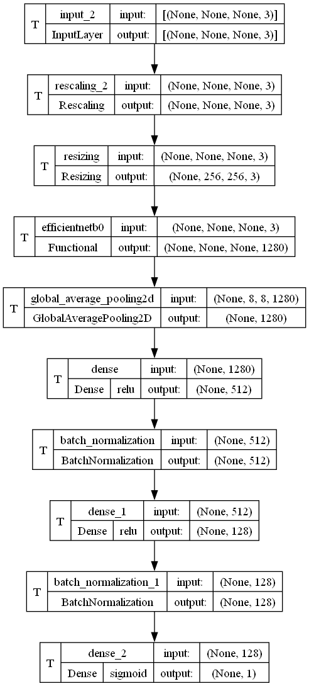
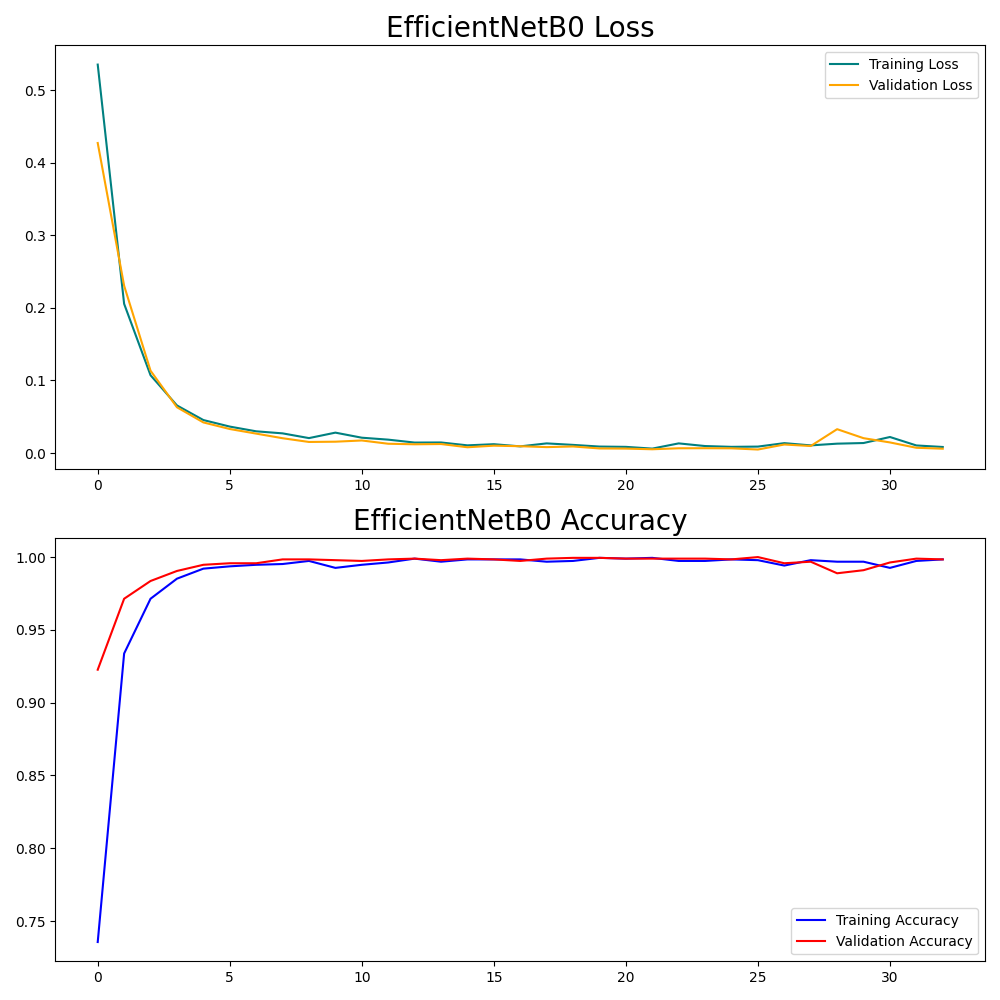
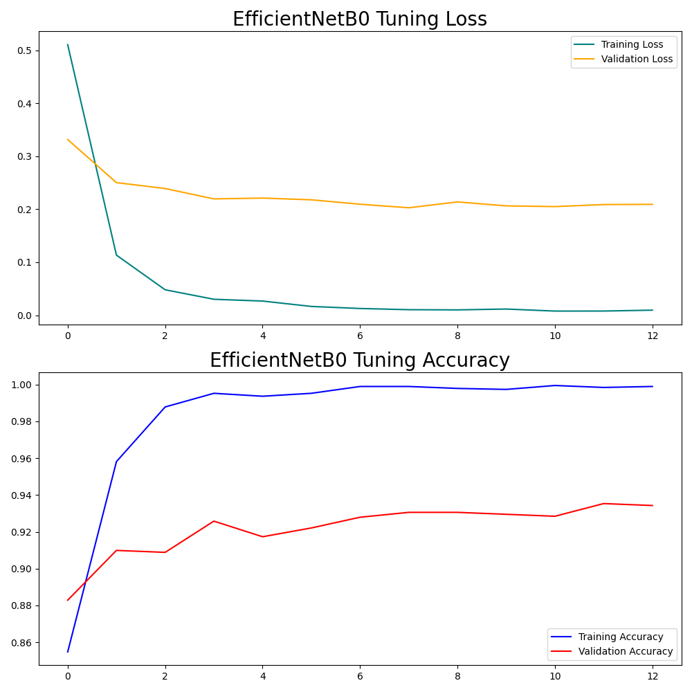
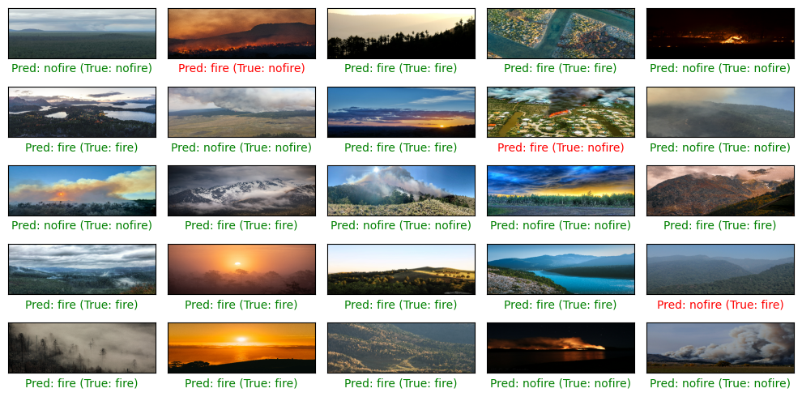

# Wildfire Detection Model Training and Fine-tuning

This project focuses on the development of a machine learning model aimed at detecting wildfires.

## Project Structure

- `classifier_train_on_augment.ipynb`: The main Jupyter notebook containing the code for training and fine-tuning the TensorFlow model.
- `EfficientNetB0_architecture.png`: Visualization of the model architecture used for the initial training phase.

- `EfficientNetB0_training_hist.png`: Training history plot, showing accuracy and loss during the initial training phase.

- `EfficientNetB0_fine_tuning_hist.png`: Fine-tuning history plot, detailing accuracy and loss improvements during the fine-tuning phase, when training the model on augmented images

- `output.png`: Sample output from the model, showing predictions if there is a wildfire in test imagery vs the truth label.
 

## Model Overview

We utilize the EfficientNetB0 architecture as our base model due to its efficiency and accuracy in handling image classification tasks. Initial training was conducted with a subset of the data to adapt the model to the specific task of wildfire detection. Subsequent fine-tuning adjusted deeper model layers to improve accuracy further.

## Setup

To run this notebook, ensure you have the following prerequisites installed:

- Python
- TensorFlow
- Matplotlib
- NumPy

## Running the Notebook

1. Clone this repository to your local machine or cloud environment.
2. Ensure you have Jupyter Notebook or JupyterLab installed.
3. Navigate to the cloned directory and start Jupyter:
   ```bash
   jupyter notebook
   ```
4. Open `classifier_train_on_augment.ipynb` and run the cells sequentially.